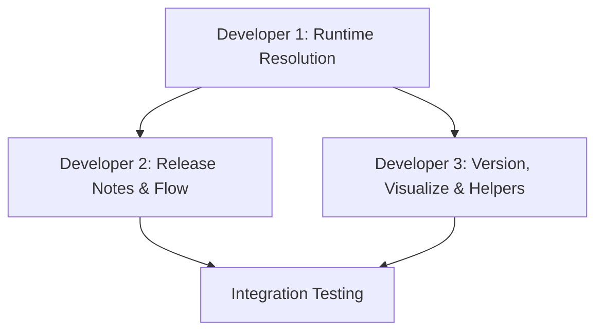

# Three-Developer Migration Plan
*Commander.js Monorepo Migration - Phase 2 & 3*

## ⚙️ Development Environment Setup

### **Node.js Version Management**
```bash
# All developers must use Node.js v22.12.0 (specified in .nvmrc)
nvm use                    # Automatically uses .nvmrc version
node --version            # Should output: v22.12.0

# If you don't have Node v22.12.0 installed:
nvm install v22.12.0
nvm use v22.12.0
```

**⚠️ Important**: The runtime module resolution issues we're experiencing may be related to the Node.js version mismatch. Node.js v22 has improved ES module support and workspace package resolution.

## 🎯 Current State & Objectives

### ✅ **Completed (Phase 1)**
- **Foundation Infrastructure**: Monorepo structure with npm workspaces
- **Core Packages**: `@cplace-cli/core`, `@cplace-cli/git-utils`, `@cplace-cli/cli` 
- **Commander.js Integration**: CLI framework established with proper option parsing
- **Repos Package**: Complete structural migration with Commander.js integration
- **Build System**: TypeScript path mappings and workspace dependencies working

### 🎯 **Mission: Complete Command Migration**
**Goal**: Migrate remaining 40+ TypeScript files from `src/commands/` to modern monorepo packages with Commander.js integration, enabling parallel development by 3 developers.

---

## 👥 Developer Assignments

### **🔧 Developer 1: Infrastructure & System Architecture** 
**Role**: Build System Specialist & Critical Path Owner  
**Timeline**: 3-4 days | **Start**: Immediately

#### **🚨 Critical Path Tasks** *(Blocks other developers)*
1. **Fix Runtime Module Resolution** ⚡ *Priority 1*
   ```bash
   # Current issue: Node.js can't resolve @cplace-cli/* packages at runtime
   node dist/packages/cli/src/cli.js --help  # ❌ ERR_MODULE_NOT_FOUND
   ```
   - **First**: Upgrade to Node.js v22.12.0 (improved ES module + workspace support)
   - Configure nx build system for proper module bundling/resolution
   - Implement solution: nx bundling, relative imports, or package.json exports
   - Validate CLI executable works: `cplace-cli repos --help`
   - **Success Criteria**: All workspace packages resolve at runtime

2. **Complete nx Build System Configuration** 
   - Set up nx.json with proper build targets for all packages
   - Configure build dependencies and caching
   - Implement parallel build strategy for all command packages
   - **Success Criteria**: `nx build-all` compiles entire monorepo

#### **Primary Tasks** *(Can be done in parallel with critical path)*
3. **Complete Repos Package Business Logic Migration**
   - Migrate `src/commands/repos/UpdateRepos.ts` → bridge with Commander.js action
   - Migrate `src/commands/repos/WriteRepos.ts` → handle freeze/unfreeze options
   - Migrate `src/commands/repos/CloneRepos.ts` → handle depth parameter
   - Migrate `src/commands/repos/BranchRepos.ts` → handle parent/push options
   - Migrate additional subcommands: `add-dependency/`, `MergeSkeleton.ts`, `ValidateBranches.ts`
   - **Implementation Pattern**:
     ```typescript
     .action(async (options, command) => {
         const params: ICommandParameters = convertCommanderToLegacy(options, command);
         const updateCommand = new UpdateRepos();
         if (updateCommand.prepareAndMayExecute(params)) {
             await updateCommand.execute();
         }
     });
     ```

4. **Testing Infrastructure & Validation**
   - Update Jest configurations for monorepo structure
   - Ensure existing tests work with new package imports
   - Create integration tests for CLI command execution
   - **Success Criteria**: `npm test` passes for all packages

#### **🎯 Developer 1 Success Criteria**
- [ ] CLI executable resolves all workspace packages at runtime
- [ ] All repos subcommands work end-to-end: `cplace-cli repos update/write/clone/branch`
- [ ] nx build system compiles all packages
- [ ] Tests pass and CI/CD ready

---

### **📝 Developer 2: Command Package Migration (High Priority)**
**Role**: Release Notes & Flow Commands Specialist  
**Timeline**: 4-5 days | **Dependencies**: Runtime resolution from Developer 1

#### **Primary Tasks**
1. **Migrate Release Notes Package** 🔥 *High Business Impact*
   ```bash
   # Target: packages/command-release-notes/
   ├── src/
   │   ├── index.ts                    # Package exports
   │   ├── ReleaseNotesCommand.ts      # Commander.js integration
   │   ├── CheckMessages.ts            # Migrate from src/commands/release-notes/
   │   ├── GenerateReleaseNotes.ts     # Core generation logic
   │   ├── MergeReleaseNotes.ts        # Release notes merging
   │   └── ReleaseNotesMessagesFile.ts # Database file handling
   ├── package.json                    # Workspace dependencies
   └── tsconfig.json                   # Package-specific config
   ```
   
   - **Complex Requirements**: 
     - Handle `messages_*.db` database files
     - Multiple subcommands: `generate`, `check`, `merge`
     - Language parameter support (`--lang en/de`)
     - Commit range handling (`--from`, `--to`)
   
   - **Commander.js Integration Pattern**:
     ```typescript
     export function createReleaseNotesCommand(): Command {
         const releaseNotes = new Command('release-notes');
         releaseNotes
             .command('generate')
             .option('--from <commit>', 'Start commit')
             .option('--to <commit>', 'End commit (default: HEAD)')
             .option('--lang <lang>', 'Language (en/de)')
             .action(async (options) => {
                 const generator = new GenerateReleaseNotes();
                 // Bridge to legacy implementation
             });
         return releaseNotes;
     }
     ```

2. **Migrate Flow Package** 🌊
   ```bash
   # Target: packages/command-flow/
   ├── src/
   │   ├── index.ts
   │   ├── FlowCommand.ts           # Commander.js integration  
   │   ├── Upmerge.ts               # Core upmerge logic
   │   ├── UpmergeAnalyzer.ts       # Branch analysis
   │   ├── ReleaseNumber.ts         # Version handling
   │   └── SplitRepository.ts       # Repository operations
   ```
   
   - **Complex Requirements**:
     - Upmerge operations between release branches
     - Release version analysis and conflicts detection
     - Git branch manipulation and merge strategies
     - `--release`, `--no-push`, `--upmerge` options

3. **CLI Integration**
   - Update `packages/cli/src/cli.ts` to include both commands
   - Test integration with existing CLI structure
   - Coordinate with other developers to avoid merge conflicts

#### **🎯 Developer 2 Success Criteria**
- [ ] Release notes commands work: `cplace-cli release-notes generate --from abc123`
- [ ] Flow commands work: `cplace-cli flow --upmerge --release 5.0`
- [ ] All existing release notes functionality preserved
- [ ] Package builds and integrates with CLI

---

### **⚙️ Developer 3: Command Package Migration (Medium Priority)**
**Role**: Version, Visualize & Infrastructure Cleanup  
**Timeline**: 3-4 days | **Dependencies**: Runtime resolution from Developer 1

#### **Primary Tasks**
1. **Migrate Version Package** 📋
   ```bash
   # Target: packages/command-version/
   ├── src/
   │   ├── index.ts
   │   ├── VersionCommand.ts       # Commander.js integration
   │   ├── Version.ts              # Version operations  
   │   └── RewriteVersions.ts      # Version rewriting logic
   ```
   
   - **Requirements**: Handle `version.gradle` files, custom branch version rewriting
   - **Commander.js**: `--rewrite-versions` option integration

2. **Migrate Visualize Package** 📊  
   ```bash
   # Target: packages/command-visualize/
   ├── src/
   │   ├── index.ts
   │   ├── VisualizeCommand.ts     # Commander.js integration
   │   ├── VisualizeCommand.ts     # Core visualization (rename to avoid conflict)
   │   └── VisualizeDelegate.ts    # Delegation logic
   ```
   
   - **Requirements**: Branch dependency visualization, PDF generation, regex filtering
   - **Commander.js**: `--pdf`, `--regex-for-exclusion`, `--regex-for-inclusion` options

3. **Migrate Helpers Package** 🛠️
   ```bash
   # Target: packages/helpers/  
   ├── src/
   │   ├── index.ts
   │   ├── CplaceVersion.ts        # Version utilities
   │   └── GradleBuild.ts          # Gradle build operations
   ```
   
   - **Critical**: Update ALL package dependencies to use `@cplace-cli/helpers`
   - **Coordinate**: With other developers as they migrate packages

4. **Legacy Cleanup & Dependency Management** 🧹
   - Remove old `src/commands/` directory structure (after full migration)
   - Remove `meow` dependency and related imports
   - Clean up unused dependencies in root `package.json`
   - Update documentation to reflect new structure

#### **🎯 Developer 3 Success Criteria**
- [ ] Version commands work: `cplace-cli version --rewrite-versions`
- [ ] Visualize commands work: `cplace-cli visualize --pdf`
- [ ] Helpers package used by all other packages
- [ ] Legacy code cleanup completed
- [ ] Documentation updated

---

## 🤝 Coordination Strategy

### **🚨 Critical Dependencies**


**Day 1-2**: Developer 1 must complete runtime module resolution  
**Day 3+**: Developers 2 & 3 can work in parallel  
**Final Days**: All developers coordinate integration testing  

### **🔄 Daily Coordination Protocol**
1. **Morning Sync** (15 min):
   - Share previous day progress
   - Identify blockers and dependencies
   - Coordinate CLI integration changes

2. **Shared Resources Management**:
   - **CLI Integration**: All developers modify `packages/cli/src/cli.ts`
     - Use feature branches: `dev1/runtime-fixes`, `dev2/release-notes`, `dev3/version-visualize`
     - Coordinate merge timing to avoid conflicts
   - **Package Dependencies**: Coordinate workspace dependency updates
   - **Testing**: Share testing strategies and validation approaches

3. **Branch Strategy**:
   ```bash
   # Each developer works on feature branches
   git checkout -b dev1/infrastructure-fixes     # Developer 1
   git checkout -b dev2/release-notes-flow       # Developer 2  
   git checkout -b dev3/version-visualize-cleanup # Developer 3
   
   # Merge order: dev1 → dev2 → dev3 → main
   ```

### **📋 Integration Checkpoints**
- **Checkpoint 1** (Day 2): Developer 1 runtime resolution working
- **Checkpoint 2** (Day 4): All command packages migrated  
- **Checkpoint 3** (Day 6): Full CLI integration and testing
- **Final Validation** (Day 7): Legacy cleanup and documentation

---

## ✅ Success Criteria & Validation

### **📊 Migration Completion Metrics**
- **File Migration**: 40+ TypeScript files from `src/commands/` → `packages/`
- **Package Count**: 6 command packages fully migrated and integrated
- **Command Coverage**: All CLI commands work with Commander.js
- **Test Coverage**: Existing functionality preserved and tested

### **🧪 Final Validation Checklist**
```bash
# Environment Tests
node --version                              # ✅ Should show v22.12.0
npm --version                               # ✅ Should show >=9.0.0

# CLI Functionality Tests
cplace-cli --help                           # ✅ Shows all migrated commands
cplace-cli repos update --verbose          # ✅ Repos command works
cplace-cli release-notes generate --help   # ✅ Release notes command works  
cplace-cli flow --upmerge                   # ✅ Flow command works
cplace-cli version --rewrite-versions       # ✅ Version command works
cplace-cli visualize --pdf                  # ✅ Visualize command works

# Build System Tests  
npm run build                               # ✅ All packages compile
npm test                                    # ✅ All tests pass
nx build-all                               # ✅ nx build system works

# Package Resolution Tests
node dist/packages/cli/src/cli.js --help   # ✅ No module resolution errors
npm run link && cplace-cli --help          # ✅ Global installation works
```

### **📁 Final Project Structure**
```
cplace-npm-tools/
├── packages/
│   ├── cli/                    # ✅ Main CLI with Commander.js
│   ├── core/                   # ✅ Shared core functionality  
│   ├── git-utils/              # ✅ Git operations
│   ├── helpers/                # ✅ Shared utilities (Developer 3)
│   ├── command-repos/          # ✅ Repository operations (Developer 1)
│   ├── command-release-notes/  # 🎯 Release notes (Developer 2)
│   ├── command-flow/           # 🎯 Flow operations (Developer 2)
│   ├── command-version/        # 🎯 Version management (Developer 3)
│   └── command-visualize/      # 🎯 Visualization (Developer 3)
├── src/                        # 🗑️ Legacy (to be removed)
├── dist/                       # ✅ Built packages
├── nx.json                     # 🎯 nx configuration (Developer 1)
├── CLAUDE.md                   # ✅ Updated with collaboration info
└── MIGRATION_PLAN.md           # ✅ This document
```

---

## 🚀 Getting Started

### **For Developer 1** (Infrastructure Lead):
```bash
# 0. Ensure correct Node.js version
nvm use                                          # Uses .nvmrc (Node v22.12.0)
node --version                                   # Should show v22.12.0

# 1. Start with critical path - runtime resolution
git checkout -b dev1/infrastructure-fixes
cd packages/cli && npm run build
node ../../dist/packages/cli/src/cli.js --help  # Debug this error first

# 2. Configure nx build system  
npm install -D nx
# Create nx.json configuration

# 3. Complete repos business logic migration
# Focus on UpdateRepos.ts, WriteRepos.ts, CloneRepos.ts, BranchRepos.ts
```

### **For Developer 2** (Release Notes & Flow):
```bash
# 0. Ensure correct Node.js version
nvm use                                          # Uses .nvmrc (Node v22.12.0)

# Wait for Developer 1 runtime resolution, then:
git checkout -b dev2/release-notes-flow
mkdir -p packages/command-release-notes/src
mkdir -p packages/command-flow/src

# Start with release-notes (higher priority)
# Focus on GenerateReleaseNotes.ts and Commander.js integration
```

### **For Developer 3** (Version, Visualize & Cleanup):
```bash  
# 0. Ensure correct Node.js version
nvm use                                          # Uses .nvmrc (Node v22.12.0)

# Wait for Developer 1 runtime resolution, then:
git checkout -b dev3/version-visualize-cleanup
mkdir -p packages/command-version/src
mkdir -p packages/command-visualize/src
mkdir -p packages/helpers/src

# Start with helpers (needed by other packages)
# Then version and visualize commands
```

---

**🎯 Target Completion: 7-10 days with 3 developers in parallel**

*This plan enables efficient parallel development while managing dependencies and coordination points. Each developer has clear ownership and success criteria.*